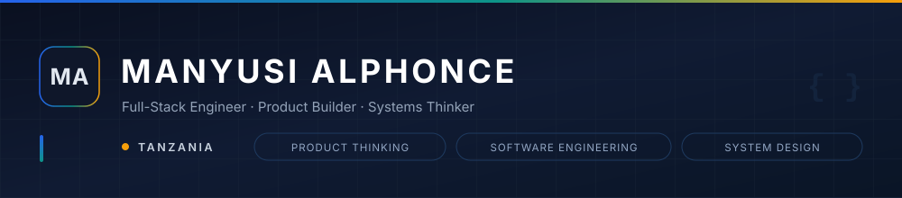
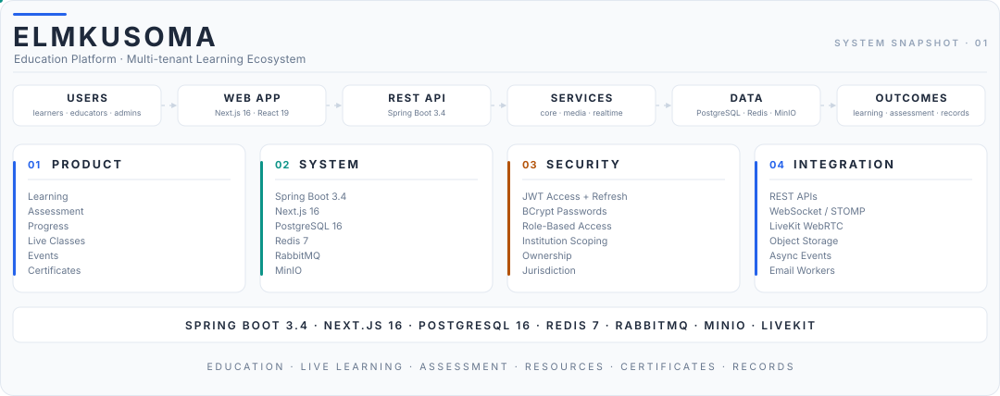
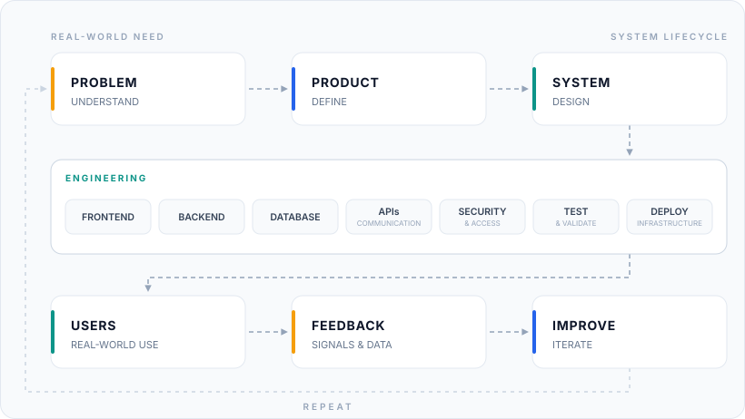
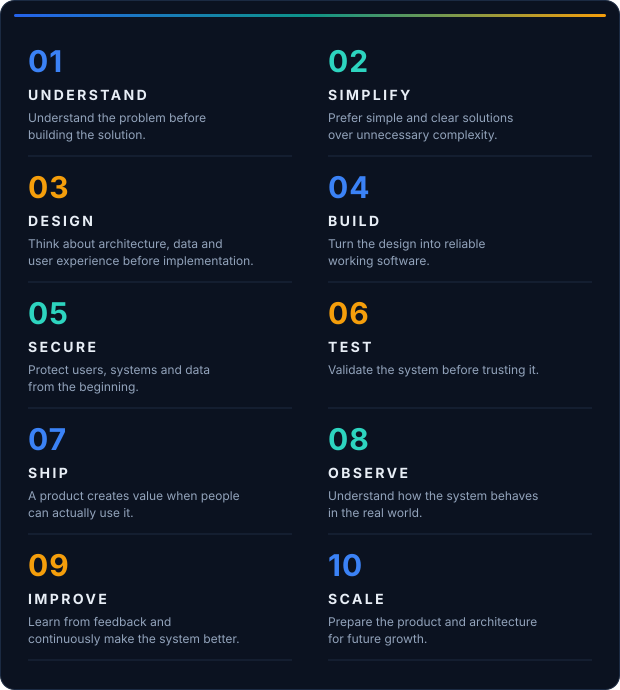
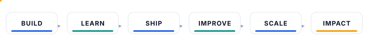

<div align="center">



# MANYUSI ALPHONCE

**Full-Stack Engineer · Product Builder · Systems Thinker**
🇹🇿 **Tanzania**

<p>
  <a href="mailto:manyusialphonce2002@gmail.com"></a>
  &nbsp;&nbsp;
  <a href="YOUR_LINKEDIN_URL"></a>
  &nbsp;&nbsp;
  <a href="YOUR_PORTFOLIO_URL"></a>
</p>


</div>

## 👋 About Me

I'm **Manyusi Alphonce** — a Full-Stack Engineer, Product Builder and Systems Thinker from Tanzania.

I turn real-world problems into practical digital products: education platforms, business systems, data-driven tools and scalable web applications.

**Product Thinking + Software Engineering + System Design + Real-World Impact**

I don't only write code. I think about the complete journey:

<table>
<tr>
<td align="center"><b>01 · PROBLEM</b><br/><sub>real-world need</sub></td>
<td align="center"><b>02 · PRODUCT</b><br/><sub>defined value</sub></td>
<td align="center"><b>03 · SYSTEM</b><br/><sub>designed architecture</sub></td>
</tr>
<tr>
<td align="center"><b>04 · USERS</b><br/><sub>real people, real use</sub></td>
<td align="center"><b>05 · FEEDBACK</b><br/><sub>signals &amp; data</sub></td>
<td align="center"><b>06 · IMPROVEMENT</b><br/><sub>iterate &amp; scale</sub></td>
</tr>
</table>

## `$ whoami`

```text
Name        : Manyusi Alphonce
Role        : Full-Stack Engineer / Product Builder
Location    : Tanzania 🇹🇿
Focus       : Web Applications, APIs, Systems & Digital Products
Mindset     : Build → Ship → Learn → Improve
```

---

## 🚀 What I'm Building

<table>
<tr>
<td width="50%"><b>🎓 ELMKUSOMA</b><br/>Education &amp; Learning Platform<br/><sub>Education</sub></td>
<td width="50%"><b>🌍 TDOP</b><br/>Tanzania Digital Opportunity Platform<br/><sub>Digital Opportunity</sub></td>
</tr>
<tr>
<td><b>🏢 Manyusi Technologies</b><br/>Digital Products &amp; Technology Solutions<br/><sub>Digital Products</sub></td>
<td><b>💼 Manyusi Sales System</b><br/>Sales &amp; Business Operations<br/><sub>Sales Operations</sub></td>
</tr>
<tr>
<td><b>🍽️ Restaurant Management System</b><br/>Restaurant Operations<br/><sub>Restaurant Operations</sub></td>
<td><b>🚚 Logistics Management System</b><br/>Logistics &amp; Operations<br/><sub>Logistics</sub></td>
</tr>
<tr>
<td><b>🏠 Hostel Management System</b><br/>Hostel &amp; Accommodation Management<br/><sub>Hostel Management</sub></td>
<td>&nbsp;</td>
</tr>
</table>

### ELMKUSOMA — System Snapshot

The platform as a running system, not a screen: four Spring Boot services behind a Next.js client, institution-scoped on PostgreSQL, with Redis, RabbitMQ, MinIO and LiveKit underneath.

<div align="center">

</div>

## 🛠️ Tech Stack

<table>
<tr>
<td width="96" valign="middle"><b>FRONTEND</b></td>
<td></td>
</tr>
<tr>
<td valign="middle"><b>BACKEND</b></td>
<td></td>
</tr>
<tr>
<td valign="middle"><b>DATABASE</b></td>
<td></td>
</tr>
<tr>
<td valign="middle"><b>DEVOPS</b></td>
<td></td>
</tr>
<tr>
<td valign="middle"><b>TOOLS</b></td>
<td></td>
</tr>
</table>

---

## 📊 GitHub Analytics

<div align="center">

</div>

## 📈 Contribution Activity

Contribution history rendered from the GitHub API by this repository's own workflow — no third-party service.

<div align="center">

</div>

<details>
<summary>Contribution snake</summary>

<div align="center">

</div>

</details>

---

## 🧩 How I Think About Software

Good software is not only about writing code. I think about the **complete system** — from the person using it to the infrastructure running behind it.

<div align="center">

<br/>
**Useful · Secure · Reliable · Maintainable · Scalable**
</div>

## 🧠 Engineering Principles

<div align="center">

</div>

<div align="center">

> **"The best software is not the software with the most features.**
>
> **It is the software that solves the right problem."**
>
> — MANYUSI ALPHONCE

</div>

## 💡 Development Philosophy

<div align="center">

<b>BUILD THINGS<br/>THAT<br/>MATTER.</b>

<br/>

I believe technology should not exist simply because it can be built.
It should exist because it solves a problem, creates value, improves an experience or opens a new opportunity.

<br/>

UNDERSTAND → BUILD → SHIP → IMPROVE

</div>

## 🌍 Why I Build

Technology becomes meaningful when it solves problems that people actually experience. I'm interested in building products that can contribute to:

<table>
<tr>
<td width="50%">🎓 Better access to education</td>
<td width="50%">💼 More digital opportunities</td>
</tr>
<tr>
<td>🏢 Better business operations</td>
<td>📊 Better access to information</td>
</tr>
<tr>
<td>🌐 Digital transformation</td>
<td>🚀 Entrepreneurship and innovation</td>
</tr>
<tr>
<td>🇹🇿 Tanzania's growing technology ecosystem</td>
<td><i>Software that is not only technically interesting, but also <b>useful in the real world</b>.</i></td>
</tr>
</table>

## 📚 Currently Learning

<table>
<tr>
<td width="50%"><b>🏗️ System Architecture</b><br/><sub>Scalable and maintainable systems</sub></td>
<td width="50%"><b>🔐 Application Security</b><br/><sub>Authentication, authorization and data protection</sub></td>
</tr>
<tr>
<td><b>⚙️ Backend Engineering</b><br/><sub>APIs, services and business logic</sub></td>
<td><b>☁️ DevOps</b><br/><sub>Linux, containers, deployment and infrastructure</sub></td>
</tr>
<tr>
<td><b>🧠 AI Engineering</b><br/><sub>AI-powered features and intelligent products</sub></td>
<td><b>📊 Data Systems</b><br/><sub>Data-driven products and decisions</sub></td>
</tr>
</table>

## 🚀 What's Next

<div align="center">

<br/>
**Engineering + Innovation + Practicality + Real-world Impact**
</div>

## 🤝 Collaboration

I'm open to collaborating on projects involving:

<table>
<tr>
<td width="33%">🚀 Startups and new products</td>
<td width="34%">💻 Full-stack applications</td>
<td>🎓 Education technology</td>
</tr>
<tr>
<td>💼 Business management systems</td>
<td>🧠 AI-powered products</td>
<td>🌍 Social-impact technology</td>
</tr>
<tr>
<td>🔐 Secure digital platforms</td>
<td>🌐 Open-source projects</td>
<td>💡 Interesting technical ideas</td>
</tr>
</table>

I enjoy working with people who want to turn ideas into useful products.

---

## 📫 Let's Connect

<div align="center">

<b>HAVE AN IDEA?</b>
<br/>
<b>LET'S BUILD IT.</b>

<br/>

**Product · Engineering · Innovation**

<br/>

<a href="mailto:manyusialphonce2002@gmail.com"></a>
&nbsp;
<a href="YOUR_LINKEDIN_URL"></a>
&nbsp;
<a href="YOUR_PORTFOLIO_URL"></a>
&nbsp;
<a href="https://github.com/manyusialphonce"></a>

</div>

---

<div align="center">


<br/>

**BUILD · SHIP · LEARN · IMPROVE**

🇹🇿 **Tanzania**

<br/>

**Manyusi Alphonce**

*Full-Stack Engineer · Product Builder · Systems Thinker*

<br/>

<a href="https://github.com/manyusialphonce"></a>

<br/>

© Manyusi Alphonce

</div>
